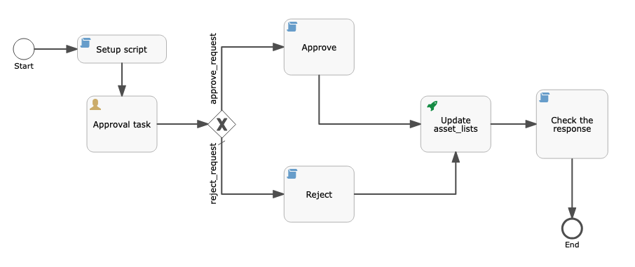
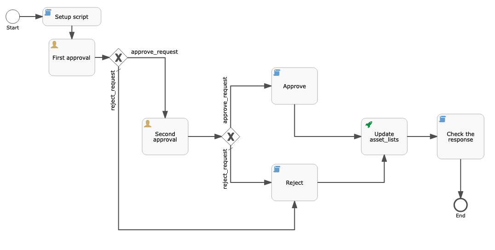
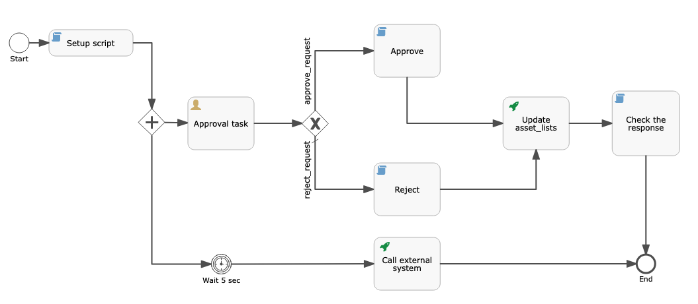

# Requirements for access request workflow templates

## Required start variables

Below are the start form properties that are required for a workflow template to be compatable with the workflow type `Access request for data product`.

| Id                     | Name                              | Type   | Expression                             | Description                                                                                                                               |
| ---------------------- | --------------------------------- | ------ | -------------------------------------- | ----------------------------------------------------------------------------------------------------------------------------------------- |
| business_justification | Business justification            | string |                                        | The business justification the subscriber provided when requesting access                                                                 |
| order_id               | Subscription ID                   | string |                                        | The ID of the CAMS asset list that represents the subscription, more on this below                                                        |
| order_requester        | Subscription requester            | string | ${cpd:conf('{"cpd_type":"cpd_user"}')} | The user that made the request to subscribe to the data product. The expression will display the value as a user instead of as a user ID. |
| dp_owner               | Product owner                     | string | ${cpd:conf('{"cpd_type":"cpd_user"}')} | The owner of the data product. The expression will display the value as a user instead of as a user ID.                                   |
| dp_name_with_version   | Data Product Name with Version ID | string |                                        | The name and version of the data product.                                                                                                 |
| dp_assignees           | Data Product Assignee             | string | ${cpd:conf('{"cpd_type":"cpd_user"}')} | This field is currently not used but is still required.                                                                                   |
| group_assignees        | Group Assignees                   | string |                                        | This field is currently not used but is still required.                                                                                   |
| dp_id                  | Product ID                        | string |                                        | The ID of the data product.                                                                                                               |
| description            | Description                       | string |                                        | The description of the data product.                                                                                                      |
| order_details          | Subscription details              | string | ${cpd:conf('{"cpd_type":"url"}')}      | A link to the subscription details. The expression will display the value as a URL instead of a string.                                   |
| product_details        | Product details                   | string | ${cpd:conf('{"cpd_type":"url"}')}      | A link to the data product. The expression will display the value as a URL instead of a string.                                           |


## How to approve or reject a request

Once a request has been approved or rejected in the workflow, it needs to be reported back to DPH. Workflows provide a way to make internal API calls using the authorization of the user that last acted on the workflow. This means that if a user acts on a task in their task inbox, the workflow can then make API calls on their behalf. If a request is approved, the data delivery process will be triggered.

### Making API calls to internal services

All of the below steps must be followed to approve or reject requests. See the samples for an example of how this is done.

1. To make an HTTP call in Flowable, add a Http Service Task.
2. The base URL for all internal calls using this method is `https://cpd-internal`. To accept or reject a request, use `https://cpd-internal/v2/asset_lists/${order_id}`.
3. Add `Cpd-Use-Current-User: true` to the list of headers in place of adding an authorization header.
4. Add an execution listener to the Http Service Task. Set the event to `start` and for the delegate expression, set the value to `${cpdInternalHttpExecutionListener}`.
5. For approving or rejecting data access requests, the body of the request takes the following values:

- If the request has been approved, set the body to: `[{"op": "replace", "path": "/state", "value": "ready_to_deliver"},{"op": "add", "path": "/message", "value": "comment"}]`.
- If it has been rejected, set the body to: `[{"op": "replace", "path": "/state", "value": "rejected"},{"op": "add", "path": "/message", "value": comment}]`
- Replace comment with a string value that the user will see as the reason for the approval/rejection.

When this is triggered, the API will be called using the authentication of the user that last acted on the workflow. This can mean the last person to act on a task in the Task Inbox, or it could mean the person who triggered the workflow to be created. Only certain users have the ability to make the above call to change the state of a subscription.

### Authorizing users to change the state of a subscription

Not every user should be able to change the state of a subscription. To select which users can change the state of the subscription that uses this workflow for approval, follow the below steps:

1. An Http Service Task that changes the state of a subscription, must be preceded by a user task.
2. The ID of a user task that can trigger a subscription state must have the prefix `state-change-`.
3. A user task with the ID prefix `state-change-` must have no assignments. That means the `Assignee`, `Candidate users`, and `Cadidate groups` fields must all be empty.
4. When creating a workflow configuration with this template, for the user tasks with the `state-change-` prefix, be sure to set a list of users or user groups as the assignees.

This selected list of users and user groups will be authorized to change the state of a subscription that uses this workflow.

# The provided samples
There are a few sample workflow templates that have been provided. Some can be used by simply uploading them to the software while some may require modification before they are ready for use.

## One step approval process



This a very simple template which has only one step to approve or reject a request. There is one user task and depending on the action taken by the approver, the API call will have a different request body.

This template can be uploaded without modification and can be used in different workflow configurations to create configurations that have different groups of approvers.

## Two step approval process



This template contains two user tasks, both with an accept and reject option. If the first task is rejected, the access request is rejected and the workflow terminates. If the first task is approved, then the task is assigned to a new group of users who have the option to approve or reject the request. If the second task is approved, access to the data is granted and the workflow terminates.

This template can be uploaded without modification and can be used in different workflow configurations to create configurations that have different groups of approvers.

## Approving from an external system




There may be use cases where approval to certain data needs to be done through a system external to Data Product Hub. This template is an example of how the workflow can make a call to an external system to register the data access request. This method still requires a user task to complete the approval process. In the template, in parallel to the user task being created, a HTTP call will be made. This call can include the ID of the user task by using the variable `createdTaskId` to help inform the external system how to report the result of the external system's approval back to the task inbox.

Once review of the request is complete in the external system, there are two options to progress the request in Data Product Hub.

1. Have the user task assigned to a user who then manually opens the task inbox and approves or rejects the request.
2. Have the external system make an API call to the task inbox to act on the request.

To accomplish the second option, the below must be followed:

1. Have a user in Data Product Hub with the `Viewer` community role that represents actions of the external system.
2. Assign that user to the user task when creating a workflow configuration with this workflow template.
3. When the review is complete in the external system, use the authentication of this user to make the following API call.

Call `POST /v3/workflow_user_tasks/{task_id}/actions`, using the task ID mentioned above. Provide the action the user is taking. Use `approve` or `-reject` as required. These values are defined in the template and can therefore differ from template to template. Provide an explanation for the action being taken, this can be an arbitrary string. Use the following body:

```json
{
  "action": "complete",
  "form_properties": [
    {
      "id": "action",
      "value": "approve"
    },
    {
      "id": "comment",
      "value": "explanation"
    }
  ]
}
```

### Retrieving the task ID

To retrieve the ID of a task once it has been created, follow the below steps. Refer to the sample for an example on how this is done.

1. In the user task, create a new task listener.
2. Select `create` as the event.
3. ${task.setVariable("createdTaskId", task.getId())};
4. For the expression, set `${task.setVariable("createdTaskId", task.getId())};` as the value.

Once the task is created, this will save the value of the ID to the `createdTaskId` variable.

To use this ID in an HTTP call that needs to happen in parallel, use a parallel gateway as seen in the sample.

1. Ensure that the checkbox next to Asynchronous is disabled.
2. Set the flow order so that the user task comes before the activity that requires the task ID.
3. Set a 5 second timer before the other activity to ensure the task has been created before trying to use the ID.

Now the ID is available in a variable that can be used by other activities in the workflow template.
