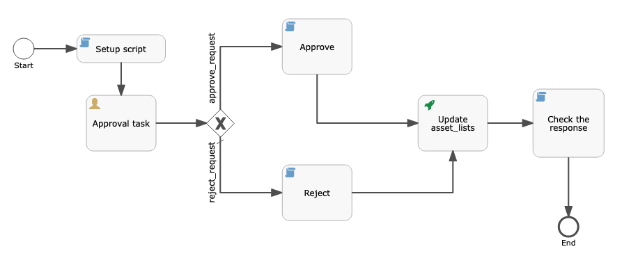
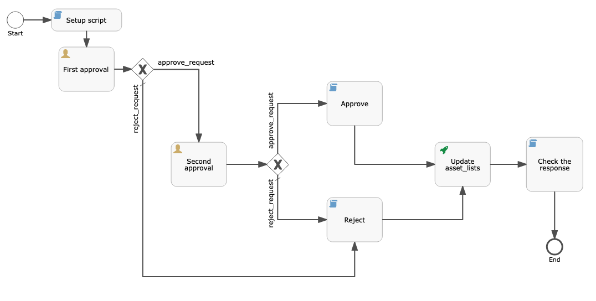
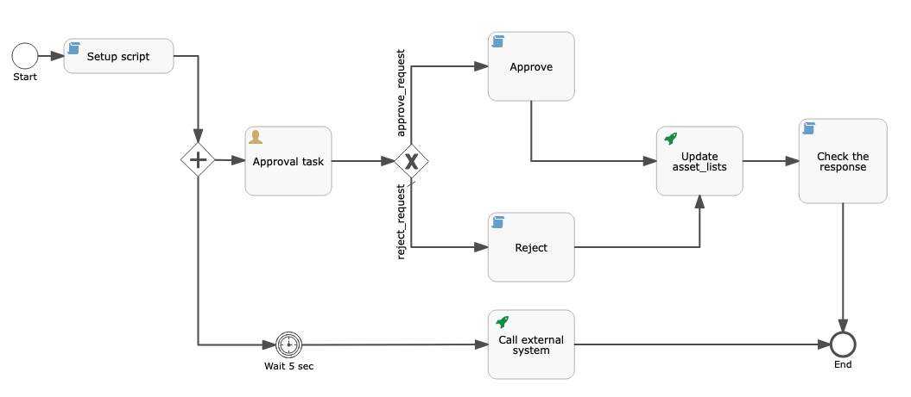
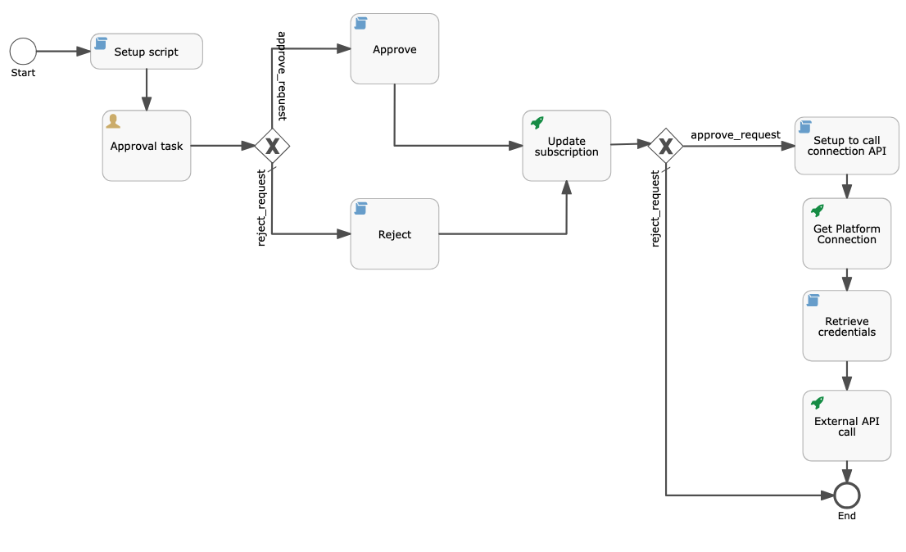

# Requirements for access request workflow templates

## Table of Contents

- [Required start variables](#required-start-variables)
- [How to approve or reject a request](#how-to-approve-or-reject-a-request)
  - [Making API calls to internal services](#making-api-calls-to-internal-services)
  - [Authorizing users to change the state of a subscription](#authorizing-users-to-change-the-state-of-a-subscription)
- [The provided samples](#the-provided-samples)
  - [One step approval process](#one-step-approval-process)
  - [Two step approval process](#two-step-approval-process)
  - [Approving from an external system](#approving-from-an-external-system)
    - [Retrieving the task ID](#retrieving-the-task-id)
  - [Approval process that triggers data delivery in an external system](#approval-process-that-triggers-data-delivery-in-an-external-system)
    - [Review and approve subscription](#review-and-approve-subscription)
    - [Deliver data assets to consumer](#deliver-data-assets-to-consumer)
    - [Complete subscription in Data Product Hub](#complete-subscription-in-data-product-hub)

## Required start variables

Below are the start form properties that are required for a workflow template to be compatable with the workflow type `Access request for data product`.

| Id                     | Name                              | Type   | Expression                             | Description                                                                                                                               |
| ---------------------- | --------------------------------- | ------ | -------------------------------------- | ----------------------------------------------------------------------------------------------------------------------------------------- |
| business_justification | Business justification            | string |                                        | The business justification the subscriber provided when requesting access                                                                 |
| order_id               | Subscription ID                   | string |                                        | The ID of the CAMS asset list that represents the subscription, more on this below                                                        |
| order_requester        | Subscription requester            | string | ${cpd:conf('{"cpd_type":"cpd_user"}')} | The user that made the request to subscribe to the data product. The expression will display the value as a user instead of as a user ID. |
| dp_owner               | Product owner                     | string | ${cpd:conf('{"cpd_type":"cpd_user"}')} | The owner of the data product. The expression will display the value as a user instead of as a user ID.                                   |
| dp_name_with_version   | Data Product Name with Version ID | string |                                        | The name and version of the data product.                                                                                                 |
| dp_assignees           | Data Product Assignee             | string | ${cpd:conf('{"cpd_type":"cpd_user"}')} | This field is currently not used but is still required.                                                                                   |
| group_assignees        | Group Assignees                   | string |                                        | This field is currently not used but is still required.                                                                                   |
| dp_id                  | Product ID                        | string |                                        | The ID of the data product.                                                                                                               |
| description            | Description                       | string |                                        | The description of the data product.                                                                                                      |
| order_details          | Subscription details              | string | ${cpd:conf('{"cpd_type":"url"}')}      | A link to the subscription details. The expression will display the value as a URL instead of a string.                                   |
| product_details        | Product details                   | string | ${cpd:conf('{"cpd_type":"url"}')}      | A link to the data product. The expression will display the value as a URL instead of a string.                                           |


## How to approve or reject a request

Once a request has been approved or rejected in the workflow, it needs to be reported back to DPH. Workflows provide a way to make internal API calls using the authorization of the user that last acted on the workflow. This means that if a user acts on a task in their task inbox, the workflow can then make API calls on their behalf. If a request is approved, the data delivery process will be triggered.

### Making API calls to internal services

All of the below steps must be followed to approve or reject requests. See the samples for an example of how this is done.

1. To make an HTTP call in Flowable, add a Http Service Task.
2. The base URL for all internal calls using this method is `https://cpd-internal`. To accept or reject a request, use `https://cpd-internal/v2/asset_lists/${order_id}`.
3. Add `Cpd-Use-Current-User: true` to the list of headers in place of adding an authorization header.
4. Add an execution listener to the Http Service Task. Set the event to `start` and for the delegate expression, set the value to `${cpdInternalHttpExecutionListener}`.
5. For approving or rejecting data access requests, the body of the request takes the following values:

- If the request has been approved, set the body to: `[{"op": "replace", "path": "/state", "value": "ready_to_deliver"},{"op": "add", "path": "/message", "value": "comment"}]`.
- If it has been rejected, set the body to: `[{"op": "replace", "path": "/state", "value": "rejected"},{"op": "add", "path": "/message", "value": comment}]`
- Replace comment with a string value that the user will see as the reason for the approval/rejection.

When this is triggered, the API will be called using the authentication of the user that last acted on the workflow. This can mean the last person to act on a task in the Task Inbox, or it could mean the person who triggered the workflow to be created. Only certain users have the ability to make the above call to change the state of a subscription.

### Authorizing users to change the state of a subscription

Not every user should be able to change the state of a subscription. To select which users can change the state of the subscription that uses this workflow for approval, follow the below steps:

1. An Http Service Task that changes the state of a subscription, must be preceded by a user task.
2. The ID of a user task that can trigger a subscription state must have the prefix `state-change-`.
3. A user task with the ID prefix `state-change-` must have no assignments. That means the `Assignee`, `Candidate users`, and `Candidate groups` fields must all be empty.
4. When creating a workflow configuration with this template, for the user tasks with the `state-change-` prefix, be sure to set a list of users or user groups as the assignees.

This selected list of users and user groups will be authorized to change the state of a subscription that uses this workflow.

# The provided samples
There are a few sample workflow templates that have been provided. Some can be used by simply uploading them to the software while some may require modification before they are ready for use.

## One step approval process



This a very simple template which has only one step to approve or reject a request. There is one user task and depending on the action taken by the approver, the API call will have a different request body.

This template can be uploaded without modification and can be used in different workflow configurations to create configurations that have different groups of approvers.

## Two step approval process



This template contains two user tasks, both with an accept and reject option. If the first task is rejected, the access request is rejected and the workflow terminates. If the first task is approved, then the task is assigned to a new group of users who have the option to approve or reject the request. If the second task is approved, access to the data is granted and the workflow terminates.

This template can be uploaded without modification and can be used in different workflow configurations to create configurations that have different groups of approvers.

## Approving from an external system




There may be use cases where approval to certain data needs to be done through a system external to Data Product Hub. This template is an example of how the workflow can make a call to an external system to register the data access request. This method still requires a user task to complete the approval process. In the template, in parallel to the user task being created, a HTTP call will be made. This call can include the ID of the user task by using the variable `createdTaskId` to help inform the external system how to report the result of the external system's approval back to the task inbox.

Once review of the request is complete in the external system, there are two options to progress the request in Data Product Hub.

1. Have the user task assigned to a user who then manually opens the task inbox and approves or rejects the request.
2. Have the external system make an API call to the task inbox to act on the request.

To accomplish the second option, the below must be followed:

1. Have a user in Data Product Hub with the `Viewer` community role that represents actions of the external system.
2. Assign that user to the user task when creating a workflow configuration with this workflow template.
3. When the review is complete in the external system, use the authentication of this user to make the following API call.

Call `POST /v3/workflow_user_tasks/{task_id}/actions`, using the task ID mentioned above. Provide the action the user is taking. Use `approve` or `-reject` as required. These values are defined in the template and can therefore differ from template to template. Provide an explanation for the action being taken, this can be an arbitrary string. Use the following body:

```json
{
  "action": "complete",
  "form_properties": [
    {
      "id": "action",
      "value": "approve"
    },
    {
      "id": "comment",
      "value": "explanation"
    }
  ]
}
```

### Retrieving the task ID

To retrieve the ID of a task once it has been created, follow the below steps. Refer to the sample for an example on how this is done.

1. In the user task, create a new task listener.
2. Select `create` as the event.
3. ${task.setVariable("createdTaskId", task.getId())};
4. For the expression, set `${task.setVariable("createdTaskId", task.getId())};` as the value.

Once the task is created, this will save the value of the ID to the `createdTaskId` variable.

To use this ID in an HTTP call that needs to happen in parallel, use a parallel gateway as seen in the sample.

1. Ensure that the checkbox next to Asynchronous is disabled.
2. Set the flow order so that the user task comes before the activity that requires the task ID.
3. Set a 5 second timer before the other activity to ensure the task has been created before trying to use the ID.

Now the ID is available in a variable that can be used by other activities in the workflow template.

## Approval process that triggers data delivery through an external system




There may be use cases where the approval of a data product triggers the delivery of the data product through a system external to Data Product Hub. This template is an example of a workflow that will make a call to an external system to deliver the data product to the consumer after the data access request is approved. This method requires a user task to complete the approval.

In this example, the workflow needs to use credentials to interact with the external system. It can retrieve credentials like an API key from a Platform Connection and authenticate API calls to the external system using that key. The Platform Connection is created by an Administrator shared with all users who are allowed to approve data access requests. 

In the template, after the data access request is approved, a HTTP call will retrieve the credentials from the Platform Connection. The call to retrieve the credentials uses the authentication of the last acting user, which in this case is the user that clicked `Approve` in the task inbox on the data access request. The retrived credentials will be used to make another HTTP call to the external system to trigger the delivery of the data product. 

The call to the external system includes the subscription ID (value of the variable `order_id`) to help inform the external system the subscription details such as information on the user who requested the data access (`order_requester`), the data assets and/or columns to be delivered, duration of the subscription etc.


### Review and approve subscription
An approver can review the details of the subscription in the Data Product Hub UI using the link provided in the data access request task or using the `GET /v2/asset_lists/{subscription_id}` API where the subscription ID is the value of the `order_id` property in the access request task. To make calls to DPH, use an authenticated token, see https://cloud.ibm.com/apidocs/dataproducts-cpd#authentication for more details.

### Deliver data assets to consumer
The external system can get the list of data assets to be delivered using `GET /v2/asset_lists/{subscription_id}/items` API. The `GET v2/asset_lists/{subscription_id}/items/{item_id}` API can be used to get the subscription details for each item. Each item in the list represents a data asset to be delivered. 

For each item in the list, 
* Use the API `GET /v2/assets/{asset_id}?catalog_id={catalog_id}` to get the details of the data asset. The asset ID is the value of the `asset_id` property in the item. The catalog ID is the value of the `asset.container.id`. 
* Get the data source details for the data asset using the `GET /v2/data_sources/{datasource_id}?catalog_id={catalog_id}` API where data source ID is the value of the `attachments.[0].datasource_type` property in the asset. 
* Get the path to the data asset in the data source from the `attachments.[0].connection_path` property.
* Additional information required for the delivery of the data asset can be obtained from the `properties.input` property. `properties.input.columns_input` property contains a list of columns to be delivered. 
* Custom properties can also be obtained. Example: `properties.input.subscriptionDuration` property contains the requested duration of the subscription.

### Complete subscription in Data Product Hub 
After the delivery of the data assets to a consumer is completed in the external system, the subscription must be completed in Data Product Hub. This can be accomplished using a few callback APIs that the external system must call.

To complete the data product delivery, the below must be followed:

1. Have one or more users in Data Product Hub with atleast `Viewer` community role who are authorized to take action on behalf of the external system.
2. Assign the users to the user task when creating a workflow configuration with this workflow template.
3. When the delivery is complete in the external system, use the authentication of one of the users to make the following API calls.

For each asset, the following must be done:

1. (Optional) Update output properties using the `PATCH /data_product_exchange/v1/subscriptions/{subscription_id}/items/{item_id}` API. The output properties contains information about the delivered asset that are visible to a consumer in the Data Product Hub Subscriptions UI 

```
PATCH /data_product_exchange/v1/subscriptions/{subscription_id}/items/

[
  {
    "op": "replace",
    "path": "/output",
    "value": {        
      "accessDuration": {
        "name": "Access Duration",
        "type": "string",
        "value": "03/19/2026 - 03/26/2026"
      },
      "hostUrl": {
        "name": "Host URL",
        "type": "string",
        "value": "https://dsta.cloud.unity.com"
      },
      "port": {
        "name": "Port",
        "type": "string",
        "value": "443"
      },
      "credentialInfo": {
        "name": "Credential Info",
        "type": "string",
        "value": "Will be emailed to you"
      }               
    }
  }
]
```
2. Update the delivery status using the `PATCH /data_product_exchange/v1/subscriptions/{subscription_id}/items/{item_id}` API. The delivery status can be one of the following: ``delivered`, `failed`. 

```
PATCH /data_product_exchange/v1/subscriptions/{order_id}/items/{item_id}

[
  {
    "op": "replace",
    "path": "/data_product_delivery_state",
    "value": "delivered"
  }
]
```

Data Product Hub service will monitor the delivery state of all the data assets and update the final state of the subscription as `succeeded`, `failed` or `partially_delivered` to complete the subscription. 